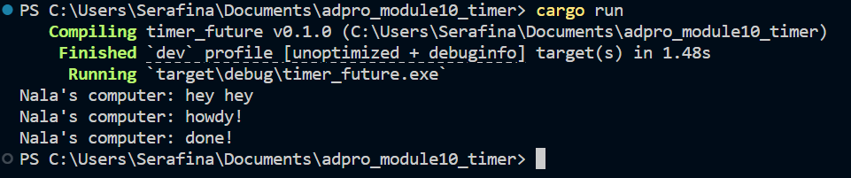

## README 
1. The spawn call just puts the async task into the queue without running it immediately. The main thread then moves on and prints “hey hey” before the executor starts polling tasks. Once executor.run begins, it pulls the queued task, prints “howdy,” waits two seconds, and finally prints “done.” That sequence gives “hey hey,” then “howdy,” then “done.”
