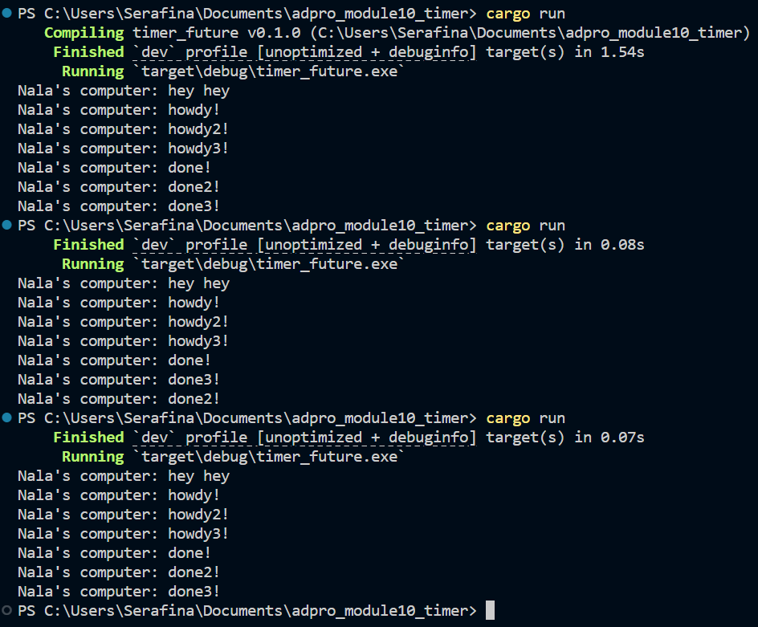
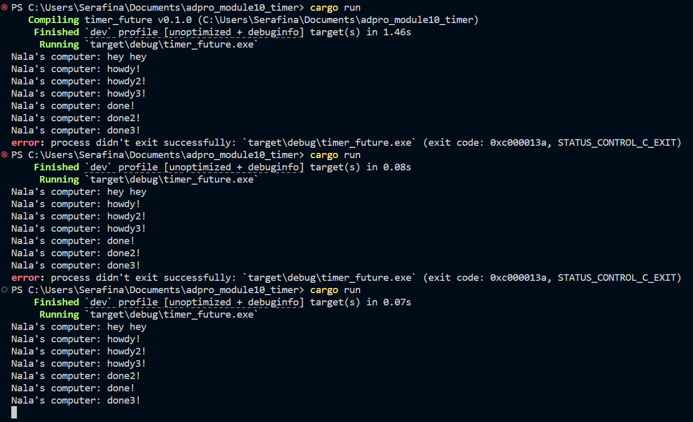

## README 
1. The spawn call just puts the async task into the queue without running it immediately. The main thread then moves on and prints “hey hey” before the executor starts polling tasks. Once executor.run begins, it pulls the queued task, prints “howdy,” waits two seconds, and finally prints “done.” That sequence gives “hey hey,” then “howdy,” then “done.”

2. #### With drop(spawner);

All three async tasks get queued up before the executor starts, so when executor.run() begins it immediately polls each one and prints “howdy!”, “howdy2!”, and “howdy3!”. Each TimerFuture::new call spun off a background thread that slept two seconds, then woke its task via the stored waker. As each thread finishes, its task is re-queued and polled again, producing “done!”, “done2!”, and “done3!”. Because drop(spawner) closed the channel, once the last “done3!” is printed the executor sees no more senders and exits cleanly.

#### Removed drop(spawner);

Spawner wasn’t dropped, so the channel stayed open and executor.run never saw an end of stream. Three tasks got queued up, so “howdy!”, “howdy2!”, and “howdy3!” printed immediately. Each TimerFuture thread woke its task after two seconds, causing “done!”, “done2!”, and “done3!” to appear. Because the channel never closed, executor.run kept waiting for more tasks and never returned. That’s why the process had to be killed manually.
